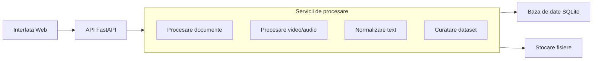

# Dataset Builder - Arhitectura modulara simplificata

Diagrama de mai jos pastreaza o vedere de ansamblu, dar evidentiaza si principalele servicii de procesare si cele doua tipuri de stocare.

## Componente cheie

- `Interfata Web`: zona prin care utilizatorul lucreaza cu aplicatia.
- `API FastAPI`: stratul care primeste cererile si coordoneaza fluxurile.
- `Procesare documente`: extrage text din PDF/TXT si pregateste intrari pentru dataset.
- `Procesare video/audio`: segmenteaza audio, transcrie si adauga fisiere in dataset.
- `Normalizare text`: adapteaza textul pentru fluxurile TTS/STT.
- `Curatare dataset`: elimina intrarile invalide sau fara audio.
- `Baza de date SQLite`: retine utilizatori, proiecte, intrari, joburi si setari.
- `Stocare fisiere`: pastreaza upload-urile, `metadata.csv`, fisierele `.wav` si staging-ul temporar.

## Flux simplificat

1. Utilizatorul interactioneaza cu interfata web.
2. Cererile ajung in API-ul FastAPI.
3. API-ul trimite cererile catre unul dintre serviciile de procesare.
4. Rezultatele sunt salvate atat in SQLite, cat si in fisierele proiectului.
