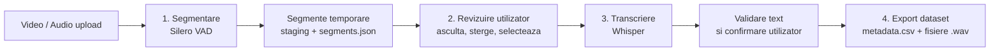

# Fluxul Video/Audio to Dataset

Diagrama de mai jos prezinta fluxul operational pentru conversia unui fisier video sau audio intr-un dataset utilizabil.

## Etape

1. `Segmentare prin Silero VAD`: fisierul sursa este impartit in segmente audio candidate.
2. `Revizuire segmente`: utilizatorul verifica segmentele generate si elimina fragmentele nedorite.
3. `Transcriere prin Whisper`: segmentele selectate sunt transcrise automat.
4. `Export metadata.csv`: segmentele aprobate sunt salvate in dataset, impreuna cu `metadata.csv`.
